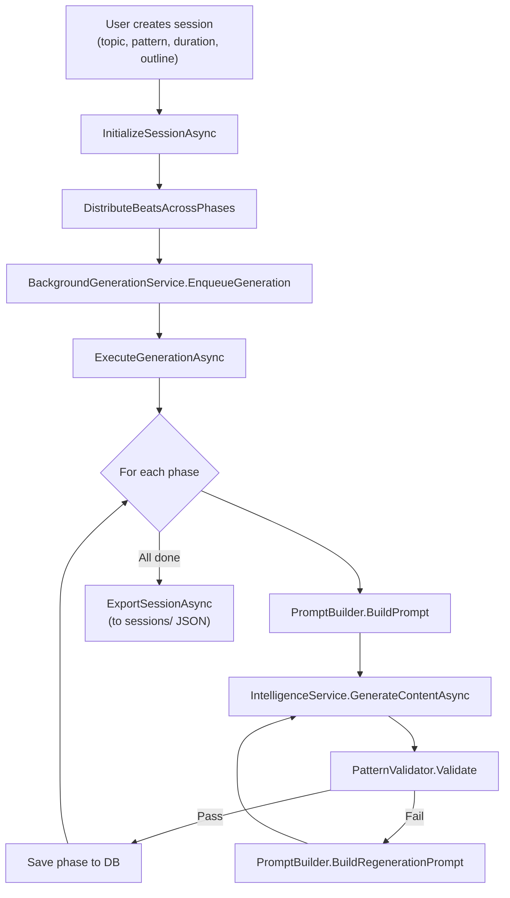
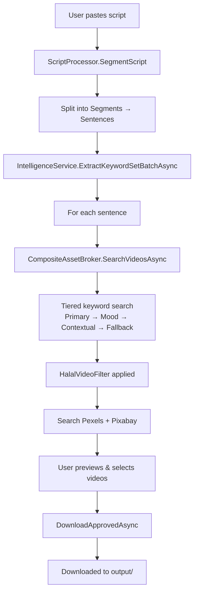
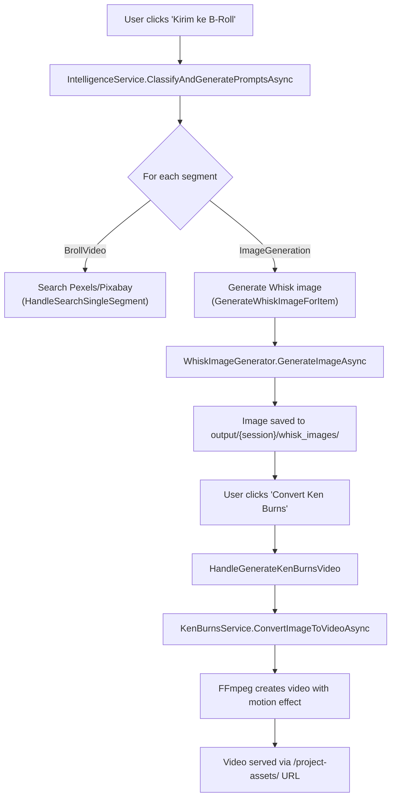
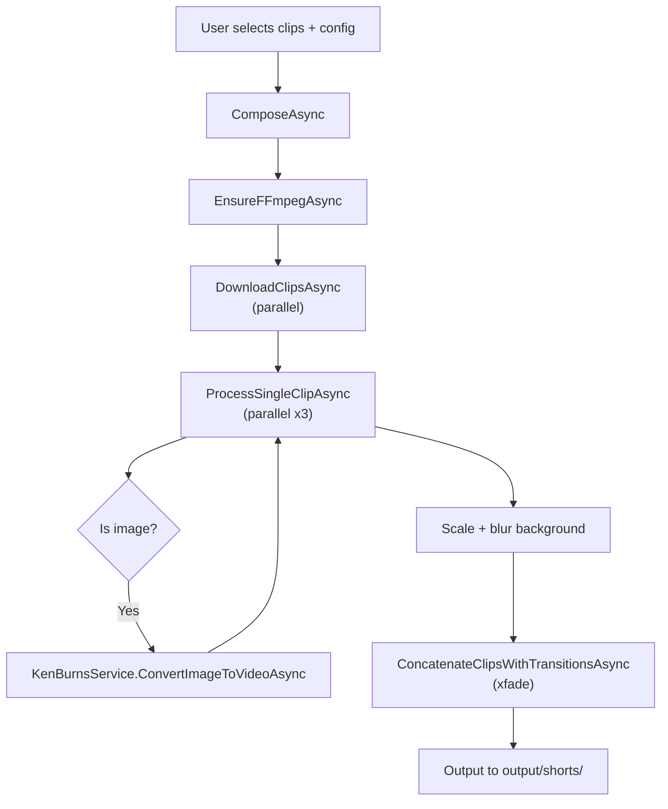
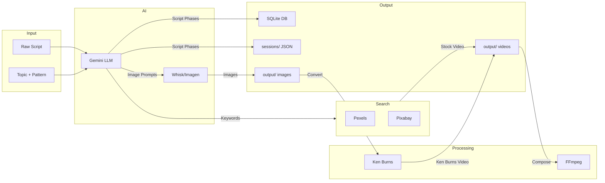

# Pipelines & Workflows

This document describes the key end-to-end pipelines in the application.

---

## Pipeline 1: Script Generation

**Entry Point**: `ScriptGenerator.razor` → "Generate" button
**Orchestrator**: `ScriptOrchestrator` → `BackgroundGenerationService`

**Key Components**:
| Component | Role |
|-----------|------|
| `PatternConfiguration` | Defines phases, rules, and structure (from `patterns/*.json`) |
| `PromptBuilder` | Builds LLM prompts with phase guidance, previous context, and rules |
| `PatternValidator` | Validates output for duration, content, and format constraints |
| `SectionFormatter` | Formats generated sections |
| `BackgroundGenerationService` | Runs generation in background via DI scope |
| `GenerationEventBus` | Publishes real-time progress to Blazor UI |

**Persistence**: SQLite (`ScriptGenerationSessions` + `ScriptGenerationPhases`) + JSON export to `sessions/`

---

## Pipeline 2: B-Roll Search & Preview

**Entry Point**: `Home.razor` → "Mulai Proses" / "Process"
**Orchestrator**: `PipelineOrchestrator`

**Key Features**:
- Keyword extraction uses layered `KeywordSet` (Primary, Mood, Contextual, Action, Fallback)
- Composite broker searches both Pexels AND Pixabay, deduplicates results
- Halal filter modifies keywords for Islamic-appropriate content
- User can re-search with custom keywords per sentence

---

## Pipeline 3: B-Roll Classification → Image Generation → Ken Burns Video

**Entry Point**: `ScriptGenerator.razor` → "Kirim ke B-Roll" button
**UI Handler**: Various handlers in `ScriptGenerator.razor`

**3-Phase State Machine (per segment)**:

| Phase | Status Field | Path Field | Error Field |
|-------|-------------|------------|-------------|
| 1. Classification | `MediaType` | `Prompt` | — |
| 2. Image Generation | `WhiskStatus` | `WhiskImagePath` | `WhiskError` |
| 3. Ken Burns Video | `WhiskVideoStatus` | `WhiskVideoPath` | `WhiskVideoError` |

**Batch Operations**:
- "Generate All Images" → `HandleGenerateAllWhiskImages` → calls `GenerateWhiskImageForItem` for each pending item
- "Convert All" → Iterates and calls `HandleGenerateKenBurnsVideo` for each done image

**Regeneration Flow**:
- "Regen Prompt + Image" → `HandleRegenPromptAndImage` → resets video state → regenerates prompt via LLM → calls `GenerateWhiskImageForItem`
- "Regen Image Only" → `HandleGenerateSingleWhisk` → calls `GenerateWhiskImageForItem`

---

## Pipeline 4: Short Video Composition

**Entry Point**: Video composition UI
**Orchestrator**: `ShortVideoComposer`

**Features**:
- Parallel clip processing (configurable `ParallelClips`)
- Blur background effect for aspect ratio mismatch
- xfade transitions between clips
- Supports both video clips and images (via Ken Burns)

---

## Data Flow Summary

